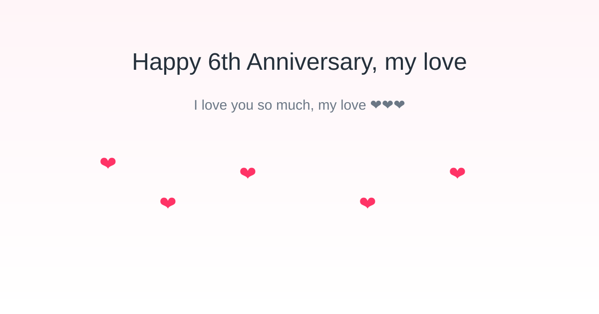

# Anniversary Card

A small interactive anniversary card built with plain HTML, CSS and JavaScript.

Features
- Greeting flow: "Happy 6th Anniversary, my love" → "Do you love me?" → "I love you soooo much, my bubu ❤❤❤"
- Playful UI: the Yes button grows when No is clicked, and there are floating hearts and sound effects.
- Download card: when you reach the final message, click "Download card" to save a PNG of the card.

Live site
- https://treta09.github.io/anniversary/

Preview

How to update and publish
1. Make edits locally (e.g., in C:\Temp\anniversary-git or your working copy).
2. Commit and push:
   git add .
   git commit -m "Update anniversary site"
   git push
3. GitHub Pages will automatically rebuild; the site is served at https://treta09.github.io/anniversary/

License
- Personal use. Enjoy!
